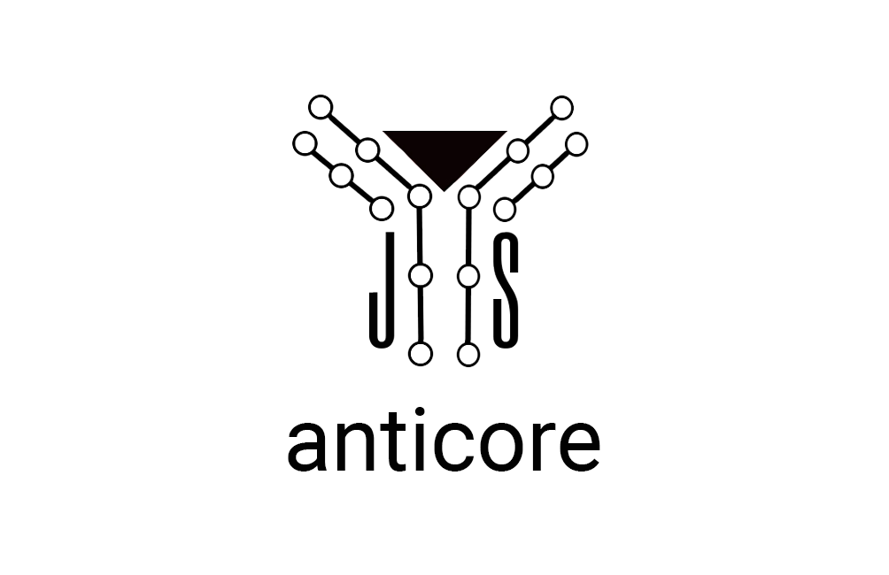

# <a name="reference"></a>

[]()
[]()
[](https://standardjs.com)

**anticore** is a library to handle your AJAX/SSE DOM contents, using some contracts.

## <a name="install">Install</a>

`npm i anticore`

## <a name="what-it-solves">What it solves?</a>

* **Based on the ES6 modules**, each contract should be written in a separated module, ideally following the [single responsibility principle](https://en.wikipedia.org/wiki/Single_responsibility_principle), improving the maintainability
* You can create your contracts as **specific or generic as you need**, increasing the **reusable components between projects**
* A contract is really short to write, **easy to replace/remove**, no need to check if it doesn't risk to break your code, there is no chain
* **No need to build any AJAX requests**, anticore is based on the forms/anchors attributes
* **No need to check the response status/content**, everything is content based, targeted by the middleware selector, then it requires <abbr title="Server-Side Rendering">SSR</abbr> contents

## <a name="how-it-works">How it works?</a>

### <a name="steps">Steps</a>
anticore doesn't do anything alone, it requires to define how to work on your contents by these 3 following steps:

<details>
  <summary name="define-your-contracts">Define your contracts</summary>
  
  A contract is defined to apply any operations (event listening, pre-validation, ...) on the elements, founds by anticore, matching the provided selector.
  
  **Important:** anticore does not appends the elements itself, import your own contracts to do it.
  
  (As a best practice, you should import the "injectors" and the end, to avoid the browser redraws as possible.)
  
```js
import { on } from 'anticore'

on(selector, listener)
```
</details>

<details>
  <summary name="define-the-fetchers">Define the fetchers</summary>
  
  The fetchers are some specific contracts, used to define how the anticore's requests are built, to automate their fetching.
  
  See [anticore-contracts/fetchers](https://github.com/Lcfvs/anticore-contracts/fetchers#readme)

  Once fetched by anticore, the contents are triggered on the defined contracts.
```js
import 'anticore-contracts/fetchers/defaults'
```
</details>

<details>
  <summary name="trigger-the-contracts-on-the-current-document">Trigger the contracts on the current document</summary>

  It's important to have the same process on the loaded document and on the fetched contents.

```js
import { trigger } from 'anticore'

trigger()
```
</details>

### <a name="Then-let-anticore-do-the-rest">Then let anticore do the rest...</a>

<details>
  <summary name="anticore-applies-all-the-contracts">anticore applies all the contracts</summary>

  * For each contract, it tries to find all the elements matching the contract selector.
  * Based on the contracts order, for each match, it provides the element to the related contract.
  * Each contract resolution **must** call the `next()` to let the next contract resolve too.
</details>

<details>
  <summary name="just-wait-the-fetchers-requests">Just wait the fetchers requests</summary>

  * It depends on your chosen fetchers, but if you use the `defaults`, it waits a `click` on an anchor or a `submit` on a form.
  * Once the event is emitted the fetcher provides the request to anticore
  * anticore fetches the request and waits the response
  * anticore parses the response to a `DocumentFragment`
  * anticore triggers on the fragment, [applying all the contracts on it](#anticore-applies-all-the-contracts)
</details>

## <a name="basic-usage">Basic usage</a>

`project/assets/js/index.js`

Used to **anticore**'s initialization and load the **contracts**

```js
// Begin of custom contracts
import './hello'
// End of custom contracts
// Handle the anchors `click` and forms `submit`, to fetch them in AJAX, automatically
import 'anticore-contracts/fetchers/defaults'
import { trigger } from 'anticore'

// Triggers the contracts on the current document
trigger()
```

`project/assets/js/hello.js`

A simple "Hello world"

```js
import { on } from 'anticore'

// Prints a simple text in the body
on('body', (element, next, url = document.location.href) => {
  element.appendChild(document.createTextNode(`Hello world from ${url}`))
  next()
})
```


## <a name="apis">APIs</a>

### <a name="on">on(selector, listener)</a>
Useful to declare a contract to be applied for any element matching the selector, where:
* `selector`: a query selector
* `listener`: a function to be applied on the matching elements
  * `element`: the matching element
  * `next`: a function to let the other contracts declared after this one (**must be always called!**) 
  * `url`: the url providing the node (can be empty, e.g. when the nodes are already in the current page)

```js
import { on } from 'anticore'

on('body', (element, next, url = document.location.href) => {
  element.appendChild(document.createTextNode(`Hello world from ${url}`))
  next()
})
```

### <a name="populate">trigger([node])</a>
Useful to apply the declared contracts on the provided `node`, where:
* **optional** `node`: the targeted node (element or document))

```js
import { trigger } from 'anticore'

trigger(document)
```

### <a name="fetch">fetch(target, request[, interval = 1000[, retries = Infinity]])</a>

Useful to create your own DOM content fetchers, where:
* `event`: the event invoking the `fetch`
* `target`: the element invoking the `fetch` (gets a `.fetching`, until resolved)
* `request`: the [Request](https://developer.mozilla.org/fr/docs/Web/API/Request) instance
* **optional** `options`: the options object
    * **optional** `interval`: the delay before a retry, if the fetch fails
    * **optional** `retries`: the number of possible retries

```js
import { fetch } from 'anticore'

fetch(event, element, request, options)
```

## <a name="sse">sse(url, [options, [reviver]])</a>

Useful to listen Server-Sent Events
```js
import sse from 'anticore/sse'

const eventSource = sse(url, options, reviver)
```


## <a name="companions">Companions</a>

* [anticore-contracts](https://github.com/Lcfvs/anticore-contracts)
* [anticore-core](https://github.com/Lcfvs/anticore-core)
* [anticore-dom](https://github.com/Lcfvs/anticore-dom)
* [anticore-utils](https://github.com/Lcfvs/anticore-utils)


## <a name="license">License</a>

[MIT](https://github.com/Lcfvs/anticore/blob/master/licence.md)
