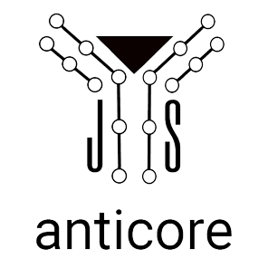

# <a name="reference"></a>

[]()
[]()
[](https://standardjs.com)

* **Content based**, anticore is a utility used to easily interact with any
  [DOM](https://developer.mozilla.org/en-US/docs/Glossary/DOM) server-side rendered element, even received in AJAX or SSE.

* **Contracts oriented**, just like an event listener, you can write some contracts to define some process on any element
  matching a selector when anticore receives it, regardless of how many (various) views needs them.

* **Automated on demand**, by a single function call, during the script initialization, **it avoids the need to write any
  AJAX request**, they are automatically deduced by the anchor/form attributes, on the user related event.

* **Very low front**, weighing only **4Ko minified** without dependency, it provides a strategy to incite you to keep
  your front code lightest as possible, letting your rendering strategy and the control to the server side.
 
  The front code is only used as an [unobstrusive](https://en.wikipedia.org/wiki/Unobtrusive_JavaScript) overlay to
  improve the user experience and let the client resources available for any other operations.

* **Reusable**, through projects, you have a lot of as **generic contracts** to cover most of your needs **at once**...
  but you can also write any project-specific contracts if needed, just based on the selector precision.

* **Server-side/framework agnostic**, no specific server configuration needed, just to receive some DOM contents
  (HTML, SVG, ...). It can be used in conjunction to your favorite libraries & frameworks.

* **Easy to maintain**, it doesn't chain all the process, each contract, ideally following the
  [single responsibility principle](https://en.wikipedia.org/wiki/Single_responsibility_principle), is simply
  replaceable/removable without the need to check the entire project.

[Live demo](https://anticore.io)


## <a name="install">Install</a>

Using NPM:
`npm i anticore`

Or using a CDN:
```js
import anticore, { defaults, on, trigger } from 'https://unpkg.com/anticore@latest/index.js'
```


### Security

This library can require the following header/meta:

`Content-Security-Policy: require-trusted-types-for 'script'; trusted-types anticore`


## <a name="contract-anatomy">Contract anatomy</a>

By default, once triggered, anticore triggers the contracts on any element matching a provided selector, event if that
element is already in the document or received after.

```js
import { on } from 'anticore'

on('a.query.selector', (matchingElement, serverResponseURL) => {
  // processes to apply on the element
})
```


## <a name="loaded">Target the AJAX/SSE loaded elements only</a>

anticore loads the contents in a `<body class="anticore">`, then you can use that class in your selector to target that
elements, specifically.

For example, we don't want to replace an already embedded element by itself. 

```js
import { on } from 'anticore'

// Replaces the current main by any new one
on('.anticore a.query.selector', (matchingElement, serverResponseURL) => {
  // processes to apply on the element
})
```

## <a name="initialization">Initialization</a> (aka `main.js`)

```js
import { defaults, trigger } from 'anticore'
// import all your contracts here

defaults() // register the default contracts, to handle your anchors/forms without target attribute
trigger() // applies the contracts on the current document elements
```

## <a name="a-very-first-contract">A very first contract</a> (aka `view-switcher.js`)

When you create an AJAX navigation, the most common operation is to replace the current contents by the user requested
contents.

To do that, commonly...

* you need to create a lot of functions to build some AJAX (`XMLHttpRequest`/`fetch`) requests
* you need to check if the response is the expected response (eg. 403, 404, 500, ...)
* you need to write some functions to treat the received contents
* you need to update the user's history

... requiring an abstraction to avoid code repetitions

With anticore, it's really shorter/simpler!

Since the `<main>` & `<title>` are unique in a page, you can easily write that process with a unique contract.

```js
import { on } from 'anticore'

// matching any received <main> / <title>
on('.anticore > main, .anticore title', (element, url) => {
  // creating a selector based on the element node name
  const selector = element.nodeName.toLowerCase()
  // retrieving the same embedded element in the document
  const current = document.querySelector(selector)

  // replacing the embedded element by the new one
  current.parentNode.replaceChild(element, current)

  if (selector === 'title') {
    // updating the history
    history.pushState({}, element.innerHTML, url)
  } else {
    window.scrollTo(0, 0)
  }
})
```

_Voilà_, import it in your `main.js` and your AJAX navigation is resolved **for all your pages, at once!**.

**Caution**: to improve the user experience and the performances, it's recommanded to import the "switchers" as very last
contracts, in your `main.js`.

```js
import { defaults, trigger } from 'anticore'
// non-switching contracts here
import './view-switcher.js'

defaults()
trigger()
```

Example:

`index.html`
```html
<!DOCTYPE html>
<html lang="en">
    <head>
        <meta charset="UTF-8">
        <title>Initial title</title>
        <script src="/assets/main.js" type="module"></script>
    </head>
    <body>
        <main>
            <h1>Initial title</h1>
            <a href="/response">Load the response</a> 
        </main>
    </body>
</html>
```

`response`
```html
<title>Response title</title>
<main>
    <h1>Response title</h1>
</main>
```

Resolves to
```html
<!DOCTYPE html>
<html lang="en">
    <head>
        <meta charset="UTF-8">
        <title>Response title</title>
        <script src="/assets/main.js" type="module"></script>
    </head>
    <body>
        <main>
            <h1>Response title</h1>
        </main>
    </body>
</html>
```

## <a name="apis">APIs</a>

### <a name="on">on(selector, listener)</a>
Useful to declare a contract to be applied for any element matching the selector, where:
* `selector`: a query selector
* `listener`: a function to be applied on the matching elements
  * `element`: the matching element
  * `url`: the url providing the node (can be empty, e.g. when the nodes are already in the current page)

```js
import { on } from 'anticore'

// An listener can be async
on('body', async (element, url) => {
  element.appendChild(document.createTextNode(`Hello world from ${url}`))
})
```

### <a name="trigger">trigger([node])</a>
Useful to apply the declared contracts on the provided `node`, where:
* **optional** `node`: the targeted node (element or current document))

```js
import { trigger } from 'anticore'

trigger(document)
```

### <a name="fetch">fetch(request, event = null, target = null)</a>

Useful to create your own DOM content fetchers, where:
* `request`: the [Request](https://developer.mozilla.org/fr/docs/Web/API/Request) instance
* `event`: the event invoking the `fetch`
* `target`: the element invoking the `fetch` (gets a `.fetching`, until resolved)

** If no `event` is provided, anticore just fetches without DOM parsing, not contracts triggering **

```js
import { fetch } from 'anticore'

fetch(request, event, target) // uses triggers the contracts
fetch(request) // just fetches

```

## <a name="sse">sse(url, [options, [reviver]])</a>

Useful to listen Server-Sent Events
```js
import { sse } from 'anticore'

const eventSource = sse(url, options, reviver)
```

## <a name="listen">listen(event, target, listener[, options])</a>

Useful to listen events, on any support (touch and/or not)

It provides a function to remove the listener, without any arguments needed
```js
import { listen } from 'anticore'

const forget = listen(event, target, listener, options)
```

## <a name="notable-changes">Notable changes from V3</a>

The **V4** is now promise-based, the V3 `next()` is removed, if you need to await some async operations, just use an `async` listener.
 

## <a name="license">License</a>

[MIT](https://github.com/Lcfvs/anticore/blob/master/licence.md)

## <a name="sponsors">Sponsors</a>

[](https://www.jetbrains.com/?from=anticore)
